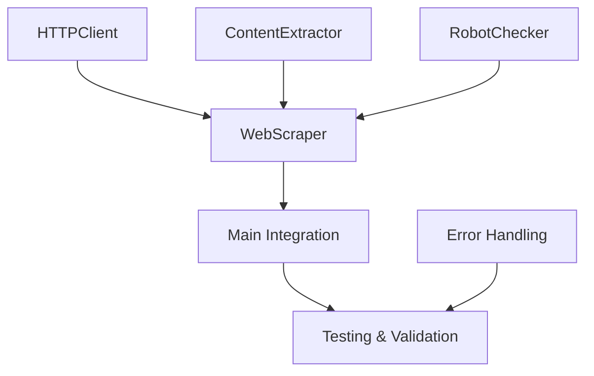

# Phase 2: Web Scraping Engine Implementation Plan

## Overview

Phase 2 transforms the completed Phase 1 infrastructure into a fully functional web scraper by implementing the core scraping functionality. This phase builds upon the robust configuration management, database operations, and logging systems established in Phase 1.

### Primary Objectives

- ✅ **Foundation Ready**: Phase 1 infrastructure complete and validated
- 🎯 **HTTP Client**: Robust web requests with retry logic and error handling
- 🎯 **Content Extraction**: HTML parsing and meaningful content extraction
- 🎯 **Robots.txt Compliance**: Respectful web scraping practices
- 🎯 **Duplicate Detection**: Efficient content change detection
- 🎯 **Integration**: Seamless integration with existing infrastructure
- 🎯 **Error Handling**: Comprehensive network and parsing error recovery

### Success Metrics

- Successfully scrape all enabled URLs from configuration
- Handle network errors gracefully with appropriate retry strategies
- Extract meaningful titles and content from various HTML structures
- Respect robots.txt when configured and log compliance status
- Complete scraping cycle within 5 minutes for up to 10 URLs
- Memory usage stays under 100MB during execution
- Comprehensive error logging and session statistics

## Technical Architecture

### New Components Overview

```
src/scraper.py (NEW)
├── HTTPClient          # Network requests and retry logic
├── ContentExtractor    # HTML parsing and content extraction
├── RobotChecker       # Robots.txt compliance checking
├── WebScraper         # Main orchestrator
└── Custom Exceptions   # Scraping-specific error types
```

### Integration Points

- **main.py:252** - Replace TODO with `WebScraper.scrape_urls()` call
- **database.py** - Utilize existing `ScrapedContent` and `insert_content()`
- **config.yaml** - Use existing scraping configuration section
- **utils.py** - Leverage existing logging and utility functions

## Detailed Implementation Tasks

### Task 1: HTTP Client Implementation

**Priority**: Critical | **Estimated Time**: 2-3 hours

#### Objective

Create a robust HTTP client that handles all network-related operations with proper error handling, retry logic, and performance optimization.

#### Implementation Details

##### HTTPClient Class Structure

```python
class HTTPClient:
    """HTTP client with retry logic and error handling."""
    
    def __init__(self, config: Dict[str, Any]):
        """Initialize HTTP client with configuration."""
        pass
    
    def fetch_url(self, url: str) -> requests.Response:
        """Fetch URL with retry logic and error handling."""
        pass
    
    def _create_session(self) -> requests.Session:
        """Create configured requests session."""
        pass
    
    def _should_retry(self, exception: Exception, status_code: int = None) -> bool:
        """Determine if request should be retried."""
        pass
    
    def _calculate_retry_delay(self, attempt: int, base_delay: float) -> float:
        """Calculate delay for retry attempt with exponential backoff."""
        pass
    
    def _log_request_metrics(self, url: str, response: requests.Response, 
                           duration: float) -> None:
        """Log request performance metrics."""
        pass
```

##### Key Features

**Session Management**:
- Persistent session with connection pooling
- Custom headers including User-Agent configuration
- Timeout settings from configuration
- SSL verification and certificate handling

**Retry Logic**:
- Exponential backoff with jitter to prevent thundering herd
- Configurable maximum retry attempts
- Intelligent retry decisions based on error type:
  - Retry: 5xx errors, timeouts, connection errors
  - Don't retry: 4xx errors (except 429), malformed URLs

**Performance Optimization**:
- Connection pooling for multiple requests
- Streaming for large content to manage memory
- Request/response compression support
- Keep-alive connections

**Error Handling**:
- Comprehensive exception categorization
- Detailed logging of failure reasons
- Response validation (content-type, size limits)

##### Configuration Integration

```python
# Uses existing config.yaml settings:
settings = config.get_scraping_config()['settings']
- timeout: settings['timeout']
- retry_attempts: settings['retry_attempts'] 
- retry_delay: settings['retry_delay']
- user_agent: settings['user_agent']
- delay_between_requests: settings['delay_between_requests']
```

#### Deliverables

- [ ] HTTPClient class with full retry logic
- [ ] Session management and connection pooling
- [ ] Request/response logging and metrics
- [ ] Error categorization and handling
- [ ] Unit tests for various failure scenarios

---

### Task 2: Content Extraction Engine

**Priority**: Critical | **Estimated Time**: 2-3 hours

#### Objective

Implement robust HTML parsing and content extraction that can handle various website structures and extract meaningful information reliably.

#### Implementation Details

##### ContentExtractor Class Structure

```python
class ContentExtractor:
    """Extract and process content from HTTP responses."""
    
    def __init__(self, config: Dict[str, Any]):
        """Initialize content extractor with configuration."""
        pass
    
    def extract_content(self, response: requests.Response, url: str) -> ScrapedContent:
        """Extract structured content from HTTP response."""
        pass
    
    def _extract_title(self, soup: BeautifulSoup) -> Optional[str]:
        """Extract page title with multiple fallback strategies."""
        pass
    
    def _extract_main_content(self, soup: BeautifulSoup) -> str:
        """Extract main content, removing navigation and boilerplate."""
        pass
    
    def _clean_html(self, soup: BeautifulSoup) -> str:
        """Clean and normalize HTML content."""
        pass
    
    def _detect_encoding(self, response: requests.Response) -> str:
        """Detect and handle character encoding."""
        pass
    
    def _calculate_content_metrics(self, content: str) -> Dict[str, int]:
        """Calculate content metrics (length, word count, etc.)."""
        pass
```

##### Content Extraction Strategy

**Title Extraction** (in order of preference):
1. `<title>` tag content
2. `<h1>` tag content (first occurrence)
3. `<meta property="og:title">` content
4. `<meta name="title">` content
5. URL-derived title as fallback

**Content Processing**:
- Remove `<script>`, `<style>`, `<nav>`, `<footer>` elements
- Preserve main content areas: `<main>`, `<article>`, `<div class="content">`
- Clean up whitespace and normalize line breaks
- Handle special characters and Unicode properly
- Option to extract plain text vs. preserve HTML structure

**Encoding Handling**:
- Detect encoding from HTTP headers
- Fall back to meta charset tags
- Use chardet library for automatic detection
- Handle encoding errors gracefully

**Content Validation**:
- Minimum content length thresholds
- Detect and flag likely error pages (404 content, etc.)
- Validate HTML structure integrity

#### Error Recovery

- Malformed HTML: Use lxml's recovery parser
- Missing titles: Generate from URL or first heading
- Empty content: Log warning but save metadata
- Encoding issues: Attempt multiple encoding strategies

#### Deliverables

- [ ] ContentExtractor class with robust parsing
- [ ] Multi-strategy title extraction
- [ ] Content cleaning and normalization
- [ ] Character encoding detection and handling
- [ ] Content validation and error recovery
- [ ] Unit tests for various HTML structures

---

### Task 3: Robots.txt Compliance

**Priority**: High | **Estimated Time**: 1-2 hours

#### Objective

Implement respectful web scraping by checking and adhering to robots.txt rules when configured to do so.

#### Implementation Details

##### RobotChecker Class Structure

```python
class RobotChecker:
    """Check robots.txt compliance for URLs."""
    
    def __init__(self, config: Dict[str, Any], http_client: HTTPClient):
        """Initialize robot checker with configuration."""
        pass
    
    def can_fetch(self, url: str, user_agent: str) -> bool:
        """Check if URL can be fetched according to robots.txt."""
        pass
    
    def get_crawl_delay(self, url: str, user_agent: str) -> float:
        """Get crawl delay for URL and user agent."""
        pass
    
    def _fetch_robots_txt(self, base_url: str) -> Optional[str]:
        """Fetch robots.txt for domain."""
        pass
    
    def _parse_robots_txt(self, content: str) -> Dict[str, Any]:
        """Parse robots.txt content into rules."""
        pass
    
    def _get_cache_key(self, url: str) -> str:
        """Generate cache key for robots.txt data."""
        pass
    
    def _is_cache_valid(self, cache_entry: Dict) -> bool:
        """Check if cached robots.txt is still valid."""
        pass
```

##### Key Features

**Robots.txt Parsing**:
- Support for User-agent specific rules
- Disallow/Allow directive parsing
- Crawl-delay directive support
- Sitemap directive recognition (informational)

**Caching Strategy**:
- In-memory cache with TTL (default: 24 hours)
- Cache per domain to avoid repeated fetches
- Graceful cache invalidation and refresh

**Error Handling**:
- Missing robots.txt: Allow all (standard behavior)
- Invalid robots.txt: Log warning, allow all
- Network errors: Allow all with warning

**Configuration Integration**:
- `respect_robots_txt` setting enables/disables checking
- Custom user agent from configuration
- Override crawl-delay with configured delay

#### Compliance Logic

```python
# Decision flow:
if not config['respect_robots_txt']:
    return True  # Skip checking entirely

robots_txt = fetch_and_cache_robots_txt(domain)
if robots_txt is None:
    return True  # No robots.txt found, allow all

return check_rules(url, user_agent, robots_txt)
```

#### Deliverables

- [ ] RobotChecker class with full robots.txt support
- [ ] Caching mechanism for performance
- [ ] Crawl-delay integration with request timing
- [ ] Configurable compliance checking
- [ ] Unit tests for various robots.txt scenarios

---

### Task 4: Duplicate Detection Enhancement

**Priority**: Medium | **Estimated Time**: 1 hour

#### Objective

Enhance the existing content hashing system to provide efficient duplicate detection during the scraping process.

#### Implementation Details

##### Enhanced Duplicate Detection

**Pre-scrape Checking**:
- Query database for existing content hash before processing
- Skip unchanged content to save bandwidth and processing
- Log duplicate detection for monitoring

**Content Change Detection**:
- Compare new content hash with most recent stored hash
- Flag content changes for potential alerting
- Track change frequency for each URL

**Integration Points**:
- Utilize existing `calculate_content_hash()` from utils.py
- Use existing `content_exists()` method in DatabaseManager
- Enhance with last-modified header checking when available

##### Implementation in WebScraper

```python
def _should_skip_url(self, url: str, last_modified: str = None) -> bool:
    """Check if URL should be skipped due to no changes."""
    # Check last-modified header if available
    if last_modified:
        # Compare with stored last-modified
        pass
    
    # For now, always scrape to get content hash
    # Future enhancement: HEAD request for last-modified
    return False

def _check_for_duplicates(self, url: str, content_hash: str) -> bool:
    """Check if content hash already exists for URL."""
    return self.db_manager.content_exists(url, content_hash)
```

#### Deliverables

- [ ] Pre-scrape duplicate checking logic
- [ ] Integration with existing hash functions
- [ ] Content change detection and logging
- [ ] Skip mechanism for unchanged content

---

### Task 5: Main Scraper Integration

**Priority**: Critical | **Estimated Time**: 2-3 hours

#### Objective

Create the main WebScraper orchestrator that coordinates all scraping components and integrates seamlessly with the existing application infrastructure.

#### Implementation Details

##### WebScraper Class Structure

```python
class WebScraper:
    """Main web scraper orchestrator."""
    
    def __init__(self, config: Config, db_manager: DatabaseManager):
        """Initialize scraper with dependencies."""
        pass
    
    def scrape_urls(self) -> ScrapingSession:
        """Execute scraping for all configured URLs."""
        pass
    
    def scrape_single_url(self, url_config: Dict[str, Any]) -> Optional[ScrapedContent]:
        """Scrape a single URL with full error handling."""
        pass
    
    def _process_url_list(self) -> ScrapingSession:
        """Process the list of URLs from configuration."""
        pass
    
    def _handle_scraping_error(self, url: str, error: Exception) -> None:
        """Handle and log scraping errors appropriately."""
        pass
    
    def _apply_request_delay(self) -> None:
        """Apply configured delay between requests."""
        pass
    
    def _collect_session_stats(self) -> Dict[str, Any]:
        """Collect statistics for the scraping session."""
        pass
```

##### Scraping Workflow

```python
def scrape_urls(self) -> ScrapingSession:
    """
    Main scraping workflow:
    1. Load URL list from configuration
    2. Filter enabled URLs
    3. Check robots.txt compliance (if enabled)
    4. Process each URL with error handling
    5. Apply delays between requests
    6. Collect and store session statistics
    7. Return comprehensive session report
    """
```

##### Session Statistics

```python
@dataclass
class ScrapingSession:
    """Results of a scraping session."""
    session_id: str
    start_time: datetime
    end_time: datetime
    total_urls: int
    successful_scrapes: int
    failed_scrapes: int
    skipped_urls: int
    errors: List[Dict[str, Any]]
    total_content_size: int
    average_response_time: float
```

##### Integration with main.py

```python
# Replace TODO at line 252 in src/main.py:
def run(self) -> int:
    # ... existing code ...
    
    # Phase 2: Web scraping logic
    if args.dry_run:
        self.logger.info("Dry-run mode enabled - no actual scraping performed")
        # Validate configuration and simulate scraping
        scraper = WebScraper(self.config, self.database_manager)
        session = scraper.simulate_scraping()  # Dry run method
    else:
        self.logger.info("Starting web scraping process...")
        scraper = WebScraper(self.config, self.database_manager)
        session = scraper.scrape_urls()
        
        # Store session statistics
        self.database_manager.insert_scraping_stats(
            session.session_id,
            session.total_urls,
            session.successful_scrapes,
            session.failed_scrapes,
            int((session.end_time - session.start_time).total_seconds() * 1000)
        )
        
        self.logger.info(f"Scraping completed: {session.successful_scrapes}/{session.total_urls} successful")
    
    # ... rest of existing code ...
```

#### Error Handling Strategy

**Network Errors**:
- Retry with exponential backoff via HTTPClient
- Log detailed error information
- Continue with next URL after max retries

**Parsing Errors**:
- Attempt to save partial content
- Log parsing issues for debugging
- Continue processing other URLs

**Robots.txt Violations**:
- Skip URL with warning log
- Don't count as failure in statistics

**Database Errors**:
- Retry database operations
- Fail gracefully if database unavailable

#### Performance Considerations

- Process URLs sequentially to respect delays
- Memory-efficient content handling
- Configurable timeouts to prevent hanging
- Resource cleanup after each URL

#### Deliverables

- [ ] WebScraper orchestrator class
- [ ] Integration with existing main.py workflow
- [ ] Comprehensive error handling for all scenarios
- [ ] Session statistics collection and storage
- [ ] Dry-run mode support
- [ ] Performance optimization for multiple URLs

---

### Task 6: Enhanced Error Handling

**Priority**: High | **Estimated Time**: 1-2 hours

#### Objective

Implement a comprehensive error handling system with custom exception classes and intelligent error recovery strategies.

#### Implementation Details

##### Custom Exception Hierarchy

```python
class ScrapingError(Exception):
    """Base exception for scraping-related errors."""
    
    def __init__(self, message: str, url: str = None, retry_after: int = None):
        super().__init__(message)
        self.url = url
        self.retry_after = retry_after
        self.timestamp = datetime.now()

class NetworkError(ScrapingError):
    """Network-related errors (timeouts, connection failures)."""
    
    def __init__(self, message: str, url: str = None, status_code: int = None):
        super().__init__(message, url)
        self.status_code = status_code

class ParseError(ScrapingError):
    """Content parsing and extraction errors."""
    
    def __init__(self, message: str, url: str = None, content_length: int = None):
        super().__init__(message, url)
        self.content_length = content_length

class RobotsError(ScrapingError):
    """Robots.txt compliance violations."""
    
    def __init__(self, message: str, url: str = None, robots_url: str = None):
        super().__init__(message, url)
        self.robots_url = robots_url

class ConfigurationError(ScrapingError):
    """Scraping configuration errors."""
    pass
```

##### Error Decision Matrix

| Error Type | Retry | Continue | Log Level | Count as Failure |
|------------|--------|----------|-----------|------------------|
| Network timeout | Yes | Yes | WARNING | No (until max retries) |
| HTTP 5xx | Yes | Yes | WARNING | No (until max retries) |
| HTTP 4xx | No | Yes | ERROR | Yes |
| Parse error | No | Yes | ERROR | No |
| Robots.txt violation | No | Yes | WARNING | No |
| Database error | Yes | No | CRITICAL | Yes |

##### Error Recovery Strategies

**Automatic Recovery**:
- Network timeouts: Retry with exponential backoff
- Temporary server errors (5xx): Retry with delay
- Parse errors: Save partial content if available

**Manual Intervention Required**:
- Configuration errors: Stop execution, require fix
- Database unavailable: Stop execution after retries
- Persistent network issues: Continue but alert

**Graceful Degradation**:
- Single URL failures don't stop batch processing
- Parse errors save metadata without content
- Missing robots.txt doesn't block scraping

#### Enhanced Logging

```python
def _log_error(self, error: ScrapingError, context: Dict[str, Any]) -> None:
    """Log error with comprehensive context information."""
    error_data = {
        'error_type': type(error).__name__,
        'message': str(error),
        'url': error.url,
        'timestamp': error.timestamp.isoformat(),
        'context': context
    }
    
    # Log level based on error type
    if isinstance(error, NetworkError) and error.status_code >= 500:
        self.logger.warning(f"Network error (retryable): {error_data}")
    elif isinstance(error, RobotsError):
        self.logger.warning(f"Robots.txt violation: {error_data}")
    else:
        self.logger.error(f"Scraping error: {error_data}")
```

#### Deliverables

- [ ] Custom exception hierarchy for error categorization
- [ ] Error decision matrix implementation
- [ ] Enhanced error logging with context
- [ ] Automatic recovery strategies
- [ ] Error rate monitoring and alerting

---

### Task 7: Testing and Validation

**Priority**: High | **Estimated Time**: 2-3 hours

#### Objective

Create comprehensive tests to ensure all scraping components work correctly and handle various real-world scenarios.

#### Testing Strategy

##### Unit Tests

**HTTPClient Tests**:
```python
class TestHTTPClient(unittest.TestCase):
    def test_successful_request(self):
        """Test successful HTTP request handling."""
        pass
    
    def test_retry_logic(self):
        """Test retry behavior for different error types."""
        pass
    
    def test_timeout_handling(self):
        """Test request timeout scenarios."""
        pass
    
    def test_session_management(self):
        """Test session creation and reuse."""
        pass
```

**ContentExtractor Tests**:
```python
class TestContentExtractor(unittest.TestCase):
    def test_title_extraction(self):
        """Test title extraction from various HTML structures."""
        pass
    
    def test_content_cleaning(self):
        """Test HTML cleaning and normalization."""
        pass
    
    def test_encoding_detection(self):
        """Test character encoding handling."""
        pass
    
    def test_malformed_html(self):
        """Test parsing of malformed HTML."""
        pass
```

**RobotChecker Tests**:
```python
class TestRobotChecker(unittest.TestCase):
    def test_robots_txt_parsing(self):
        """Test robots.txt parsing for various formats."""
        pass
    
    def test_compliance_checking(self):
        """Test URL compliance checking."""
        pass
    
    def test_caching_behavior(self):
        """Test robots.txt caching mechanism."""
        pass
```

##### Integration Tests

**End-to-End Scraping**:
```python
class TestWebScraperIntegration(unittest.TestCase):
    def test_complete_scraping_workflow(self):
        """Test complete scraping process with real URLs."""
        pass
    
    def test_error_recovery(self):
        """Test error handling in realistic scenarios."""
        pass
    
    def test_performance_requirements(self):
        """Test that performance requirements are met."""
        pass
```

##### Mock HTTP Server

```python
class MockHTTPServer:
    """Mock server for testing various HTTP scenarios."""
    
    def __init__(self):
        self.responses = {}
    
    def add_response(self, path: str, status: int, content: str, 
                    headers: Dict[str, str] = None):
        """Add mock response for testing."""
        pass
    
    def simulate_timeout(self, path: str, delay: float):
        """Simulate timeout for specific path."""
        pass
    
    def simulate_robots_txt(self, content: str):
        """Add robots.txt response."""
        pass
```

#### Test Data

**HTML Test Cases**:
- Standard HTML with proper title and content
- HTML with missing title tag
- Malformed HTML with parsing errors
- HTML with various character encodings
- Large HTML documents for memory testing
- HTML with extensive JavaScript/CSS to test cleaning

**Robots.txt Test Cases**:
- Standard robots.txt with disallow rules
- User-agent specific rules
- Crawl-delay directives
- Malformed robots.txt files
- Missing robots.txt (404)

**Network Test Cases**:
- Successful requests (200)
- Client errors (400, 404)
- Server errors (500, 502, 503)
- Network timeouts
- Connection refused
- SSL/TLS errors

#### Performance Testing

```python
def test_memory_usage(self):
    """Ensure memory usage stays under 100MB."""
    import psutil
    import os
    
    process = psutil.Process(os.getpid())
    initial_memory = process.memory_info().rss
    
    # Run scraping process
    scraper.scrape_urls()
    
    final_memory = process.memory_info().rss
    memory_used = (final_memory - initial_memory) / 1024 / 1024  # MB
    
    self.assertLess(memory_used, 100, "Memory usage exceeded 100MB")

def test_timing_requirements(self):
    """Ensure scraping completes within 5 minutes for 10 URLs."""
    start_time = time.time()
    
    # Configure with 10 test URLs
    session = scraper.scrape_urls()
    
    duration = time.time() - start_time
    self.assertLess(duration, 300, "Scraping took longer than 5 minutes")
```

#### Deliverables

- [ ] Comprehensive unit tests for all components
- [ ] Integration tests for end-to-end workflows
- [ ] Mock HTTP server for controlled testing
- [ ] Performance tests for memory and timing
- [ ] Error scenario testing with various failure modes
- [ ] Test data sets for HTML and robots.txt variations

---

## Configuration Enhancements

### No Changes Required

The existing `config.yaml` structure already contains all necessary configuration options for Phase 2:

```yaml
scraping:
  urls:
    - url: 'https://example.com'
      name: 'Example Site'
      enabled: true
  
  settings:
    timeout: 30                    # HTTPClient timeout
    retry_attempts: 3             # HTTPClient retry logic
    retry_delay: 5                # HTTPClient retry delay
    user_agent: 'WebScraper/1.0'  # HTTPClient headers
    respect_robots_txt: true      # RobotChecker behavior
    delay_between_requests: 1     # WebScraper request pacing
```

### Optional Enhancements (Future)

Additional configuration options that could be added later:

```yaml
scraping:
  settings:
    # Content extraction options
    preserve_html: false           # Extract plain text vs HTML
    min_content_length: 100       # Skip pages with little content
    max_content_size: 10485760    # 10MB limit
    
    # Advanced HTTP options
    follow_redirects: true        # Follow HTTP redirects
    max_redirects: 5             # Maximum redirect chain
    verify_ssl: true             # SSL certificate verification
    
    # Robots.txt options
    robots_cache_ttl: 86400      # 24 hours
    robots_timeout: 10           # Robots.txt fetch timeout
```

## Integration with Existing Infrastructure

### Database Schema Compatibility

Phase 2 uses the existing database schema without modifications:

```sql
-- Existing table structure is sufficient
CREATE TABLE scraped_content (
    id SERIAL PRIMARY KEY,
    url VARCHAR(2048) NOT NULL,         -- ✅ Used
    title VARCHAR(1024),                -- ✅ Used (extracted)
    content TEXT,                       -- ✅ Used (extracted)
    content_hash VARCHAR(64),           -- ✅ Used (calculated)
    scraped_at TIMESTAMP DEFAULT CURRENT_TIMESTAMP,  -- ✅ Used
    response_status INTEGER,            -- ✅ Used (HTTP status)
    response_time_ms INTEGER,           -- ✅ Used (timing)
    content_length INTEGER,             -- ✅ Used (size)
    created_at TIMESTAMP DEFAULT CURRENT_TIMESTAMP   -- ✅ Used
);

-- Statistics table for session tracking
CREATE TABLE scraping_stats (
    id SERIAL PRIMARY KEY,
    scrape_session_id VARCHAR(64),      -- ✅ Used (session ID)
    total_urls INTEGER,                 -- ✅ Used (count)
    successful_scrapes INTEGER,         -- ✅ Used (success count)
    failed_scrapes INTEGER,             -- ✅ Used (failure count)
    total_execution_time_ms INTEGER,    -- ✅ Used (timing)
    started_at TIMESTAMP DEFAULT CURRENT_TIMESTAMP,  -- ✅ Used
    completed_at TIMESTAMP             -- ✅ Used
);
```

### Logging Integration

Phase 2 leverages the existing logging infrastructure:

```python
# Use existing logger setup
from utils import get_logger, log_performance

class WebScraper:
    def __init__(self, config: Config, db_manager: DatabaseManager):
        self.logger = get_logger(__name__)  # Existing logger system
    
    @log_performance  # Existing decorator
    def scrape_single_url(self, url_config: Dict) -> ScrapedContent:
        # Automatic performance logging
        pass
```

### Error Handling Integration

Build upon existing error handling patterns:

```python
# Follow existing patterns from database.py and config.py
try:
    content = self.scraper.scrape_single_url(url_config)
    self.db_manager.insert_content(content)
except ScrapingError as e:
    self.logger.error(f"Scraping failed for {url}: {e}")
    # Continue with next URL
except Exception as e:
    self.logger.error(f"Unexpected error: {e}")
    # Handle gracefully
```

## Performance and Quality Assurance

### Performance Requirements

| Metric | Target | Measurement Method |
|--------|--------|--------------------|
| Execution Time | < 5 minutes for 10 URLs | Timer around `scrape_urls()` |
| Memory Usage | < 100MB peak | psutil monitoring |
| CPU Usage | Minimal when idle | Background monitoring |
| Request Rate | Respect configured delays | Request timing logs |

### Quality Standards

**Code Quality**:
- PEP 8 compliance for all new code
- Type hints for all public methods
- Comprehensive docstrings
- Error handling for all external operations

**Testing Standards**:
- Unit test coverage > 90%
- Integration tests for all major workflows
- Performance tests for requirements validation
- Error scenario coverage

**Security Standards**:
- No hardcoded credentials
- Secure HTTP client configuration
- Input validation for all external data
- Robots.txt compliance when enabled

### Monitoring and Observability

**Metrics Collection**:
```python
# Metrics tracked per scraping session
session_metrics = {
    'urls_processed': 0,
    'successful_scrapes': 0,
    'failed_scrapes': 0,
    'total_content_size': 0,
    'average_response_time': 0.0,
    'robots_txt_checks': 0,
    'duplicate_content_skipped': 0,
    'errors_by_type': {},
    'memory_usage_peak': 0,
    'execution_time_total': 0.0
}
```

**Health Checks**:
- Database connectivity before scraping
- Configuration validation at startup
- Network connectivity verification
- Resource availability monitoring

## Risk Mitigation and Contingency Plans

### Technical Risks

**Risk**: Network connectivity issues  
**Mitigation**: Comprehensive retry logic, graceful degradation  
**Contingency**: Manual retry mode, offline operation capability

**Risk**: Website structure changes breaking parsing  
**Mitigation**: Robust parsing with multiple fallback strategies  
**Contingency**: Manual content extraction rules, alerting system

**Risk**: Rate limiting or IP blocking  
**Mitigation**: Respectful delays, robots.txt compliance, user agent identification  
**Contingency**: Configurable delays, proxy support (future enhancement)

**Risk**: Memory/performance issues with large content  
**Mitigation**: Streaming processing, content size limits  
**Contingency**: Incremental processing, content truncation

### Operational Risks

**Risk**: Database storage exhaustion  
**Mitigation**: Content size monitoring, archival strategies  
**Contingency**: Emergency cleanup procedures, storage alerts

**Risk**: Configuration errors  
**Mitigation**: Comprehensive validation, dry-run mode  
**Contingency**: Configuration rollback, safe defaults

**Risk**: Unhandled error scenarios  
**Mitigation**: Comprehensive error handling, graceful degradation  
**Contingency**: Manual intervention procedures, detailed logging

## Implementation Timeline

### Phase 2 Sprint Plan

**Week 1**: Core Implementation
- Days 1-2: HTTPClient implementation and testing
- Days 3-4: ContentExtractor implementation and testing
- Day 5: RobotChecker implementation

**Week 2**: Integration and Polish
- Days 1-2: WebScraper orchestrator and main.py integration
- Day 3: Enhanced error handling and custom exceptions
- Days 4-5: Comprehensive testing and performance validation

### Dependencies and Critical Path



**Critical Path**: HTTPClient → ContentExtractor → WebScraper → Integration  
**Parallel Work**: RobotChecker, Error Handling can be developed in parallel

### Milestones and Deliverables

**Milestone 1** (End of Week 1): Core components implemented  
- HTTPClient with retry logic functional
- ContentExtractor parsing various HTML structures
- RobotChecker basic compliance checking

**Milestone 2** (End of Week 2): Full integration complete  
- WebScraper orchestrating all components
- Integration with existing main.py complete
- Comprehensive test suite passing
- Performance requirements validated

**Final Deliverable**: Fully functional web scraper meeting all Phase 2 requirements

## Acceptance Criteria

### Functional Requirements

- [ ] **F1**: Fetch HTML content from all configured URLs
- [ ] **F2**: Extract page title and full HTML content reliably
- [ ] **F3**: Handle HTTP errors gracefully (404, 500, timeouts)
- [ ] **F4**: Implement retry logic with exponential backoff
- [ ] **F5**: Respect robots.txt when configured
- [ ] **F6**: Generate content hash for duplicate detection

### Integration Requirements

- [ ] Seamless integration with existing Phase 1 infrastructure
- [ ] No breaking changes to configuration or database schema
- [ ] Maintains existing logging format and error handling patterns
- [ ] Compatible with existing command-line interface

### Performance Requirements

- [ ] Complete scraping cycle within 5 minutes for up to 10 URLs
- [ ] Memory usage under 100MB during execution
- [ ] Respect configured delays between requests
- [ ] Efficient handling of large HTML documents

### Quality Requirements

- [ ] Unit test coverage > 90% for new components
- [ ] Integration tests covering complete workflows
- [ ] Performance tests validating requirements
- [ ] Comprehensive error handling for all scenarios
- [ ] Code follows existing project standards

### Documentation Requirements

- [ ] Updated CLAUDE.md with Phase 2 information
- [ ] Code documentation for all public interfaces
- [ ] Test documentation for all scenarios
- [ ] Integration examples and usage patterns

## Future Enhancements (Phase 3+)

### Planned Improvements

**Phase 3**: Database Integration Enhancement
- Advanced content analysis and categorization
- Data archival and cleanup strategies
- Query optimization and indexing improvements
- Migration and backup procedures

**Phase 4**: Process Management
- Multi-threading for parallel scraping
- Advanced scheduling and job management
- Real-time monitoring and alerting
- Web dashboard for status monitoring

**Phase 5**: Advanced Features
- JavaScript rendering support (Selenium integration)
- Content change detection and notifications
- API endpoints for external access
- Cloud deployment and scaling options

### Architectural Considerations

The Phase 2 implementation maintains flexibility for future enhancements:

- **Modular Design**: Each component can be enhanced independently
- **Interface Stability**: Public APIs designed for backward compatibility
- **Configuration Extensibility**: Easy addition of new configuration options
- **Database Compatibility**: Schema designed for future metadata additions

---

**Last Updated**: July 2025  
**Status**: Phase 1 Complete, Phase 2 Ready for Implementation  
**Estimated Effort**: 12-16 hours total development time